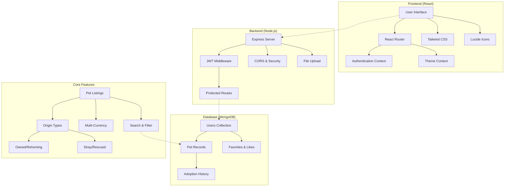
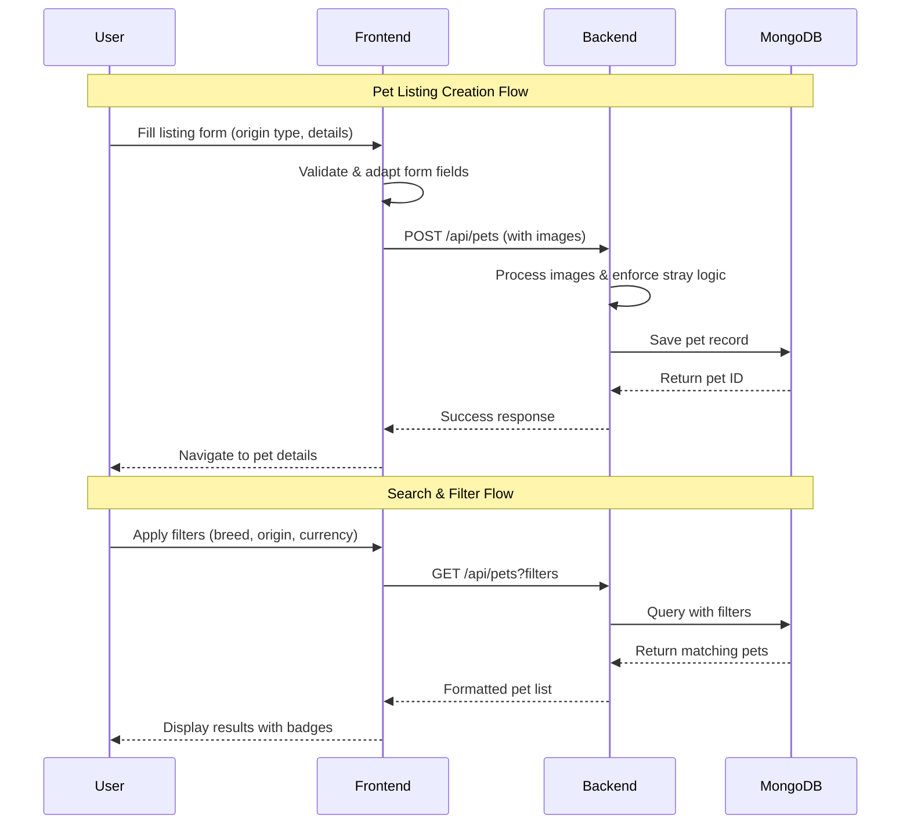

# 🐾 FurEverHome

<div align="center">


**A Modern, Compassionate Pet Adoption Platform**

*Connecting loving families with pets in need of homes*

[](./LICENSE)
[](https://reactjs.org/)
[](https://nodejs.org/)
[](https://mongodb.com/)
[](https://tailwindcss.com/)

[🚀 Live Demo](#-quick-start) • [📖 Documentation](#-documentation) • [🐛 Report Bug](https://github.com/RaoVrn/FurEverHome/issues) • [✨ Request Feature](https://github.com/RaoVrn/FurEverHome/issues)

---

</div>

## 🌟 Overview

FurEverHome is a comprehensive pet adoption platform designed to streamline the process of connecting pets with loving families. Whether you're looking to adopt a companion or need to rehome a beloved pet, our platform provides all the tools necessary for successful, ethical pet placements.

### ✨ Key Highlights

- 🏠 **Dual Listing Types**: Support for both owned pet rehoming and stray animal rescue
- 💰 **Multi-Currency Support**: Global reach with support for USD, EUR, GBP, INR, AUD, CAD, JPY
- 🎯 **Smart Matching**: Advanced filtering and search capabilities
- 📱 **Responsive Design**: Beautiful, mobile-first interface
- 🔐 **Secure Authentication**: JWT-based user management
- 📸 **Rich Media Support**: Multi-image uploads with compression
- ❤️ **Interactive Features**: Like system, favorites, and user profiles

---

## 🏗️ Architecture Overview



---

## 🚀 Features

### 🐕 Pet Management
- **Comprehensive Profiles**: Detailed pet information including temperament, health status, and compatibility
- **Rich Media Gallery**: Multiple photo uploads with thumbnail navigation
- **Smart Categorization**: Support for dogs, cats, birds, rabbits, and other animals
- **Health Tracking**: Vaccination and neutering status, medical history
- **Behavioral Insights**: Temperament tags, activity levels, and "good with" indicators

### 🏠 Listing Types
- **Owned Pet Rehoming**: For pets that need new homes due to circumstances
- **Stray Animal Rescue**: Free adoption for rescued animals with found location/date tracking
- **Dynamic Form Fields**: Context-aware forms that adapt based on listing type

### 💳 Global Currency Support
- **Multi-Currency Adoption Fees**: USD, EUR, GBP, INR, AUD, CAD, JPY
- **Automatic Free Adoption**: Stray animals automatically set to free
- **Currency Display**: Consistent formatting across all interfaces

### 🔍 Advanced Search & Filtering
- **Comprehensive Filters**: By breed, age, size, location, urgency, and origin type
- **Real-time Search**: Instant results with debounced queries
- **Saved Preferences**: User favorites and browsing history

### 👤 User Experience
- **Responsive Dashboard**: Role-based interfaces for adopters and posters
- **Profile Management**: Avatar uploads, achievements, account settings
- **Interactive Elements**: Like system, view tracking, adoption metrics
- **Accessibility**: Focus states, ARIA labels, keyboard navigation

---

## 🛠️ Technology Stack

### Frontend
```
React 19.1.1          - Modern UI framework
React Router DOM      - Client-side routing
Tailwind CSS 3.4      - Utility-first styling
React Hook Form       - Form management
Lucide React          - Icon library
React Hot Toast       - Notifications
Axios                 - HTTP client
```

### Backend
```
Node.js + Express     - Server framework
MongoDB + Mongoose    - Database and ODM
JWT                   - Authentication
Multer                - File uploads
bcryptjs              - Password hashing
CORS                  - Cross-origin support
```

### Development Tools
```
Nodemon               - Development server
PostCSS + Autoprefixer - CSS processing
ESLint                - Code linting
Git                   - Version control
```

---

## 📊 Data Flow Diagram



---

## 🚀 Quick Start

### Prerequisites
- Node.js 16+ and npm
- MongoDB 4.4+
- Git

### Installation

1. **Clone the repository**
```bash
git clone https://github.com/RaoVrn/FurEverHome.git
cd FurEverHome
```

2. **Setup Backend**
```bash
cd backend
npm install

# Create environment file
cp .env.example .env
# Edit .env with your MongoDB URI and JWT secret
```

3. **Setup Frontend**
```bash
cd ../client
npm install
```

4. **Environment Configuration**

Create `backend/.env`:
```env
NODE_ENV=development
PORT=5000
MONGODB_URI=mongodb://localhost:27017/fureverhome
JWT_SECRET=your_super_secure_jwt_secret_here
UPLOAD_PATH=uploads/
```

5. **Start Development Servers**

Terminal 1 (Backend):
```bash
cd backend
npm run dev
```

Terminal 2 (Frontend):
```bash
cd client
npm start
```

6. **Access the Application**
- Frontend: http://localhost:3000
- Backend API: http://localhost:5000

### 🎯 First Run Setup

1. **Seed Sample Data** (Optional)
```bash
cd backend
node -e "require('./src/utils/seedData')()"
```

2. **Create Admin User**
- Register through the UI
- Manually update user role in MongoDB to 'admin'

---

## 📁 Project Structure

```
FurEverHome/
├── 📂 backend/
│   ├── 📂 src/
│   │   ├── 📂 controllers/      # Request handlers
│   │   ├── 📂 middleware/       # Auth & validation
│   │   ├── 📂 models/           # MongoDB schemas
│   │   ├── 📂 routes/           # API endpoints
│   │   ├── 📂 utils/            # Helper functions
│   │   └── 📄 server.js         # Entry point
│   ├── 📂 uploads/              # File storage
│   └── 📄 package.json
├── 📂 client/
│   ├── 📂 public/               # Static assets
│   ├── 📂 src/
│   │   ├── 📂 components/       # Reusable UI
│   │   ├── 📂 contexts/         # React contexts
│   │   ├── 📂 pages/            # Route components
│   │   ├── 📂 utils/            # Frontend helpers
│   │   └── 📄 App.jsx           # Root component
│   └── 📄 package.json
├── 📄 docker-compose.yml       # Container setup
├── 📄 README.md                # Documentation
└── 📄 LICENSE                  # MIT License
```

---

## 🔧 API Reference

### Core Endpoints

| Method | Endpoint | Description | Auth Required |
|--------|----------|-------------|---------------|
| `POST` | `/api/auth/register` | User registration | ❌ |
| `POST` | `/api/auth/login` | User login | ❌ |
| `GET` | `/api/pets` | Get pets (with filters) | ❌ |
| `POST` | `/api/pets` | Create pet listing | ✅ |
| `GET` | `/api/pets/:id` | Get pet details | ❌ |
| `PUT` | `/api/pets/:id` | Update pet listing | ✅ |
| `DELETE` | `/api/pets/:id` | Delete pet listing | ✅ |
| `POST` | `/api/pets/:id/like` | Toggle pet like | ✅ |
| `POST` | `/api/pets/adopt` | Adopt pet | ✅ |

### Query Parameters

**GET /api/pets**
```
?category=dog&originType=stray&urgency=high&breed=labrador
```

**Supported Filters:**
- `category`: dog, cat, bird, rabbit, other
- `originType`: owned, stray
- `breed`: text search
- `urgency`: low, medium, high
- `location`: text search

---

## 🎨 UI Components

### Design System

Our design system emphasizes:
- **Accessibility**: WCAG 2.1 AA compliance
- **Consistency**: Unified color palette and typography
- **Responsiveness**: Mobile-first approach
- **Performance**: Optimized images and lazy loading

### Color Palette
```css
Primary: #3B82F6 (blue-500)
Secondary: #8B5CF6 (violet-500)
Success: #10B981 (emerald-500)
Warning: #F59E0B (amber-500)
Error: #EF4444 (red-500)
Neutral: #6B7280 (gray-500)
```

### Key Components
- **PetCard**: Displays pet summary with interactive elements
- **Modal**: Reusable dialog component
- **Button**: Consistent interactive element with variants
- **Input**: Form field with validation states
- **ImageCarousel**: Multi-image gallery with thumbnails

---

## 🧪 Testing

### Running Tests
```bash
# Frontend tests
cd client
npm test

# Backend tests (when implemented)
cd backend
npm test
```

### Test Coverage
- Unit tests for utility functions
- Integration tests for API endpoints
- Component tests for UI elements
- E2E tests for critical user journeys

---

## 🚀 Deployment

### Docker Deployment
```bash
docker-compose up -d
```

### Manual Deployment

1. **Build Frontend**
```bash
cd client
npm run build
```

2. **Deploy Backend**
```bash
cd backend
npm start
```

3. **Environment Variables**
```env
NODE_ENV=production
MONGODB_URI=your_production_db_uri
JWT_SECRET=your_production_jwt_secret
```

---

## 🤝 Contributing

We welcome contributions! Please see our [Contributing Guidelines](CONTRIBUTING.md) for details.

### Development Workflow
1. Fork the repository
2. Create a feature branch (`git checkout -b feature/amazing-feature`)
3. Commit changes (`git commit -m 'Add amazing feature'`)
4. Push to branch (`git push origin feature/amazing-feature`)
5. Open a Pull Request

### Code Standards
- Follow ESLint configuration
- Use Prettier for formatting
- Write meaningful commit messages
- Add tests for new features

---

## 📄 License

This project is licensed under the MIT License - see the [LICENSE](LICENSE) file for details.

---

## 🙏 Acknowledgments

- **Icons**: [Lucide React](https://lucide.dev/) for beautiful, consistent icons
- **Styling**: [Tailwind CSS](https://tailwindcss.com/) for utility-first CSS
- **Inspiration**: Local animal shelters and rescue organizations

---

## 📞 Support

- 📧 **Email**: prakash.varun.0305@gmail.com
- 🐛 **Bug Reports**: [GitHub Issues](https://github.com/RaoVrn/FurEverHome/issues)
- 💬 **Discussions**: [GitHub Discussions](https://github.com/RaoVrn/FurEverHome/discussions)
- 📚 **Documentation**: [Wiki](https://github.com/RaoVrn/FurEverHome/wiki)